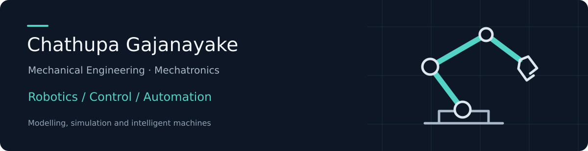

I work at the intersection of mechanical systems, robotics and control. My interests are in developing machines, modelling their dynamics, and bringing mechanical, electrical and software elements together.

I am completing a B.Sc. Engineering (Hons) in Mechanical Engineering with a minor in Mechatronics at the University of Sri Jayewardenepura, Sri Lanka. My final GPA is 3.34/4.00, with Second Class Upper Division; graduation is pending.

[LinkedIn](https://www.linkedin.com/in/chathupa-gajanayake) · [Email](mailto:chathupagaj@gmail.com) · [Research repository](https://github.com/ChathupaGajanayake/flexible-manipulator-control) · [Project portfolio](https://github.com/ChathupaGajanayake/engineering-projects)

## Featured work

### Flexible manipulator modelling and vibration control

My research on AMM-based dynamic modelling and PSO-optimized FOPID control received the Best Paper Award in the Electronics, Control, and Instrumentation Track at MERCon 2026.

The repository brings together MATLAB scripts, two Simulink models, optimized controller parameters, and saved results comparing PID and FOPID control. It includes extended work on gravity compensation and sensitivity to payload, reference angles and link stiffness.

[Explore the code, models and results →](https://github.com/ChathupaGajanayake/flexible-manipulator-control)

### Mechatronic machines and robotic systems

My project work includes a semi-automated coconut dehusking machine, a gem faceting and polishing system, a bio-inspired inspection robot, an automated air hockey system, and a mobile-controlled robotic arm.

[Browse the engineering project portfolio →](https://github.com/ChathupaGajanayake/engineering-projects)

## Industrial experience

During six months in the Global Engineering Department at Ansell Lanka, Biyagama, I contributed to packing-line automation involving six robotic arms and an AGV, robotic palletizing, and production-line improvements. My work also included support for smart-camera integration, PLC/HMI development, commissioning and troubleshooting, and Blender visualizations for a digital-twin project.

## Technical focus

| Area | Tools and experience |
| --- | --- |
| Modelling and control | MATLAB, Simulink, dynamic modelling, PID/FOPID, PSO and GA |
| Industrial automation | PLCs, HMIs, sensors, pneumatics, servo/stepper systems and VFDs |
| Robotics and vision | Dobot, Omron, FANUC, DUCO, FAIRINO and smart-camera integration |
| Mechanical design and simulation | SolidWorks, AutoCAD, ANSYS, Blender, LabVIEW, COMSOL and FlexSim |
| Programming and embedded systems | Python, C++, Arduino and ESP32 |

I am interested in graduate opportunities in robotics, automation, control systems and engineering R&D.
